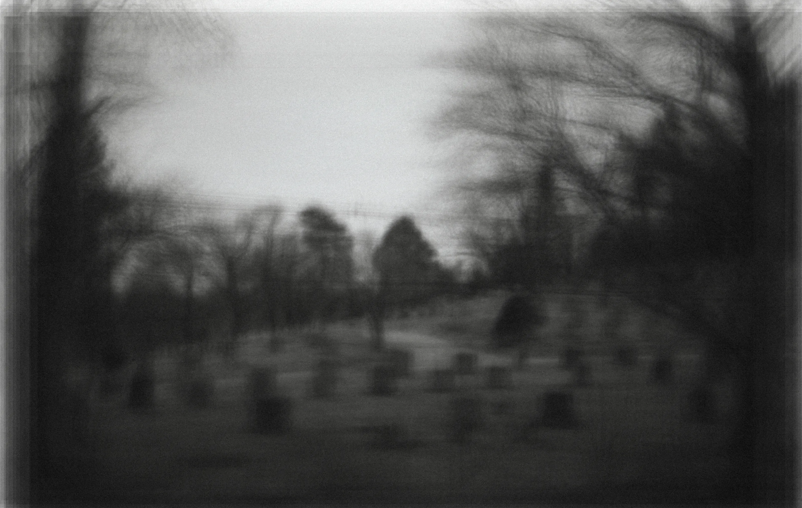

# Ceci Artist Website

A responsive React portfolio website showcasing the artistic works of Xilei Ceci Chen.



## Overview

The Ceci Artist Website is a single-page React application designed to present photography and artwork in a clean, minimalist interface. The current version is optimized for desktop/tablet viewing, with mobile responsiveness planned for future updates.

## ⚠️ Important Notes

- **This is a basic version** of the website, with more features coming soon
- **Recommended viewing on laptop/tablet** for optimal experience
- **Mobile version is under development** and will be available in future updates
- **Landing page is currently in development** and will be added in the next phase

## Features

- **Interactive Navigation**: Hover animations and intuitive link behavior
- **Project Gallery**: Grid-based thumbnail layout for project browsing
- **Image Viewer**: Detailed project view with navigation controls
- **Responsive Design**: Core components designed with future responsiveness in mind
- **Static Hosting Compatible**: Optimized for GitHub Pages deployment

## Project Structure

```
ceci-artist-website/
├── public/
│   └── images/
│       ├── home-page/
│       ├── project-folders/
│       └── instagram.svg, instagramb.svg
├── src/
│   ├── components/
│   │   ├── LandingPage.jsx
│   │   ├── HomePage.jsx
│   │   ├── Navbar.jsx
│   │   ├── ProjectThumbnail.jsx
│   │   ├── ProjectDetail.jsx
│   │   ├── ContactPage.jsx
│   │   ├── CVPage.jsx
│   │   ├── StatementPage.jsx
│   │   └── CopyrightBar.jsx
│   ├── styles/
│   │   ├── Home.css
│   │   ├── Navbar.css
│   │   ├── ProjectDetail.css
│   │   ├── ProjectThumbnail.css
│   │   └── SubPage.css
│   ├── data/
│   │   └── projects.json
│   ├── App.jsx
│   ├── main.jsx
│   └── index.css
└── package.json
```

## Design Principles

- **Typography**:
  - Navbar/clickable elements: Syncopate
  - Statement page content: Annie Use Your Telescope
  - Detail/description/CV/contact content: Murecho

- **Color Scheme**:
  - Standard text: #222222 (never pure black)
  - High contrast for accessibility compliance

- **Interactions**:
  - English text/buttons: Scale ×2 on hover
  - Chinese characters: Scale ×1 on hover
  - Instagram icon: 25px to 30px on hover
  - Animation duration: 200-300ms (smooth CSS transform)

## Installation and Local Development

1. Clone this repository:
   ```bash
   git clone https://github.com/your-username/ceci-artist-website.git
   cd ceci-artist-website
   ```

2. Install dependencies:
   ```bash
   npm install
   ```

3. Start the development server:
   ```bash
   npm run dev
   ```

4. Open http://localhost:5173 in your browser

## Deployment

This project is configured for deployment on GitHub Pages:

```bash
npm run build
```

The built files will be in the `dist` directory, ready for GitHub Pages deployment.

## Navigation Structure

- **Landing Page**: Chinese character images that enlarge on hover and navigate to Home on click
- **Home Page**: Lists all projects with hover effects, fixed navigation bar on left
- **Project Pages**: 
  - Thumbnail grid view with hover effects
  - Detail view with image navigation arrows
- **Statement/CV/Contact**: Content pages with consistent navigation

## Planned Future Updates

- **Landing Page**: Interactive introduction screen
- **Mobile Responsiveness**: Full support for mobile devices
- **Auto Upload Function**: Streamlined project addition workflow
- **Performance Optimizations**: Image lazy loading and caching improvements
- **Additional Projects**: Regular content updates

## Credits

- Design & Artwork: Xilei Ceci Chen
- Development: Xilei Ceci Chen
- Images: Xilei Ceci Chen

## License

© 2025 Xilei Ceci Chen. All rights reserved.
