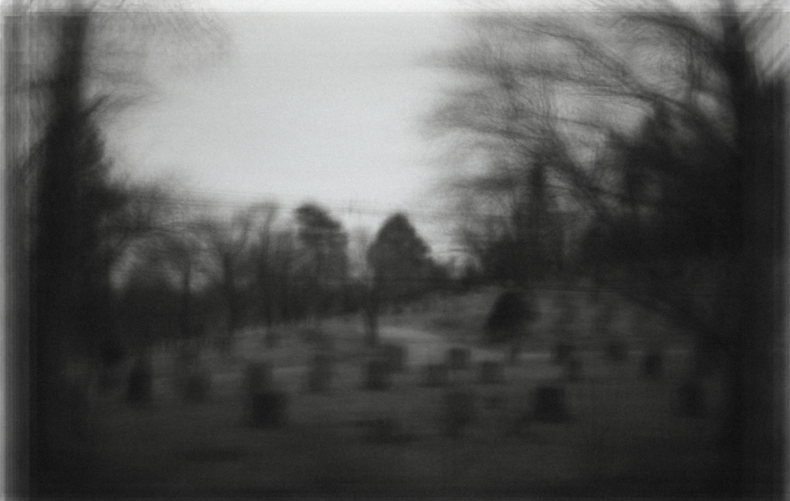

# Ceci Artist Website

A responsive, full-stack React portfolio website showcasing the artistic works of Xilei Ceci Chen.



## Overview

The Ceci Artist Website is a single-page React application designed to present photography and artwork in a clean, minimalist interface. The site features a hybrid architecture: a fixed-sidebar layout for desktop precision and a custom "film-strip" app-like experience for mobile devices.

## 🚀 Key Updates & Features

* **Full-Stack Integration:** Powered by **Supabase** (PostgreSQL) for dynamic content management. Projects, images, and CV items are fetched in real-time.
* **Mobile-First Design:**
    * **"Locked Viewport" Architecture:** Prevents browser bouncing and scroll chaining for a native app feel.
    * **Film Strip Gallery:** Mobile project details feature a horizontal, snap-scrolling carousel that maintains consistent vertical framing (`65vh`) regardless of image orientation.
    * **Smart Navigation:** Headers scroll away naturally, and footers sit logically at the end of content.
* **Deep Linking:** Every project and artwork has a unique URL for easy sharing.

## Tech Stack

* **Frontend:** React (Vite)
* **Backend / Database:** Supabase
* **Routing:** React Router DOM
* **Styling:** Pure CSS (Flexbox, Grid, CSS Variables)

## Project Structure

```text
ceci-artist-website/
├── public/
│   └── images/
│       ├── home-page/
│       └── instagram.svg
├── src/
│   ├── components/
│   │   ├── LandingPage.jsx
│   │   ├── HomePage.jsx
│   │   ├── Navbar.jsx
│   │   ├── ProjectThumbnail.jsx
│   │   ├── ProjectDetail.jsx
│   │   ├── ContactPage.jsx
│   │   ├── CVPage.jsx
│   │   ├── StatementPage.jsx
│   │   └── CopyrightBar.jsx
│   ├── styles/
│   │   ├── Home.css
│   │   ├── Navbar.css
│   │   ├── ProjectDetail.css
│   │   ├── ProjectThumbnail.css
│   │   └── SubPage.css
│   ├── supabaseClient.js  <-- Database Connection
│   ├── App.jsx
│   ├── main.jsx
│   └── index.css
└── package.json

## Design Principles

-   **Typography**:
    -   Navbar/clickable elements: *Syncopate*
    -   Statement page content: *Annie Use Your Telescope*
    -   Detail/description/CV/contact content: *Murecho*

-   **Color Scheme**:
    -   Standard text: #222222 (Soft Black)
    -   High contrast for accessibility compliance

-   **Interactions**:
    -   **Desktop:** Elements scale on hover; cursor interactions drive navigation.
    -   **Mobile:** Swipe gestures for galleries; snap-scrolling for film strips; touch-optimized tap targets.

## Installation and Local Development

1.  **Clone this repository:**
    ```bash
    git clone [https://github.com/your-username/ceci-artist-website.git](https://github.com/your-username/ceci-artist-website.git)
    cd ceci-artist-website
    ```

2.  **Install dependencies:**
    ```bash
    npm install
    ```

3.  **Environment Setup:**
    Create a `.env` file in the root directory and add your Supabase credentials to connect to the database locally:
    ```env
    VITE_SUPABASE_URL=your_supabase_url
    VITE_SUPABASE_ANON_KEY=your_supabase_anon_key
    ```

4.  **Start the development server:**
    ```bash
    npm run dev
    ```

5.  Open `http://localhost:5173` in your browser.

## Deployment (GitHub Pages)

This project is configured for deployment on GitHub Pages.

**Important:** Since this project now uses Supabase, ensure your `.env` variables are set up in your GitHub Actions secrets (if using Actions) or present during your local build.

1.  **Build the project:**
    ```bash
    npm run build
    ```
    *This creates a `dist` folder with your production-ready code.*

2.  **Deploy:**
    If you are using the `gh-pages` package:
    ```bash
    npm run deploy
    ```
    *Or manually push the contents of the `dist` folder to your `gh-pages` branch.*

## Navigation Structure

-   **Home Page:** Lists all projects with hover effects; fixed navigation bar on the left (Desktop) or Hamburger menu (Mobile).
-   **Project Pages:**
    -   **Thumbnails:** Grid view (Responsive Grid).
    -   **Details:**
        -   **Desktop:** Single image focus with arrow navigation.
        -   **Mobile:** Horizontal "Film Strip" scroll with loop detection and smart snapping.
-   **Statement/CV/Contact:** Content pages with consistent navigation and responsive typography.

## Credits

-   **Design & Artwork:** Xilei Ceci Chen
-   **Development:** Xilei Ceci Chen
-   **Images:** Xilei Ceci Chen

## License

© 2026 Xilei Ceci Chen. All rights reserved.